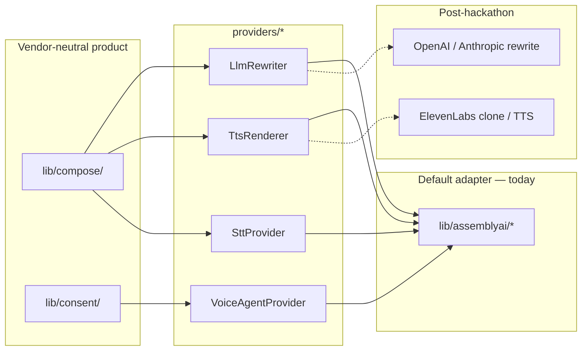

# Provider adapters

Captei’s product logic is vendor-neutral. Speech, rewrite and live qualify are
**adapters**. The Connect IA pitch line is: *stack multi-provedor; AssemblyAI
na demo atual.*

Do **not** wire multi-provider routing until a second adapter exists. The env
names below are the intended contract, documented only.

## Diagram



```
  compose/  +  consent/     ← product (no vendor names)
        │
        ▼
  providers/*               ← interfaces only (this scaffold)
        │
        ├── lib/assemblyai/*     TODAY (hackathon + demo)
        ├── ElevenLabs           POST-hackathon (clone / TTS per IDEA-LOCK)
        └── OpenAI / Anthropic   optional rewrite
```

## Today

| Interface | Default implementation |
|-----------|------------------------|
| `SttProvider` | Streaming STT via `app/api/stt-token` → `wss://streaming.assemblyai.com/v3/ws` |
| `LlmRewriter` | `lib/assemblyai/rewrite-omnichannel.ts` (LLM Gateway) |
| `TtsRenderer` | Voice Agent `greeting` verbatim — `lib/assemblyai/render.ts` / browser path |
| `VoiceAgentProvider` | `app/api/voice-token` + qualify session |

Interfaces: `lib/providers/types.ts`. Working calls stay in `lib/assemblyai/*`
until a second adapter is added — swapping them now is a regression risk for
the Connect IA / hackathon demos.

## Env pattern (documented, not wired)

```bash
CAPTEI_STT_PROVIDER=assemblyai
CAPTEI_LLM_PROVIDER=assemblyai
CAPTEI_TTS_PROVIDER=assemblyai
CAPTEI_VOICE_AGENT_PROVIDER=assemblyai
```

Valid future values (not implemented): `elevenlabs` (TTS / clone), `openai`,
`anthropic` (rewrite). Missing or unknown → treat as `assemblyai`.

Never put provider API keys in client-side code. Tokens are minted server-side.
Auth remains three-way for AssemblyAI (Bearer on Voice Agent token; bare key on
`POST /v1/agents`, `GET /v1/sessions`, streaming STT token and LLM Gateway).

End sessions explicitly: `session.end` for Voice Agent, `Terminate` for
Streaming STT. Never just close the socket.

## Post-hackathon

- **ElevenLabs** for clone / TTS (IDEA-LOCK). Do not add the SDK or new keys
  until that work is scheduled.
- Optional OpenAI / Anthropic for rewrite if AssemblyAI Gateway is not the
  production LLM.
- Routing module (e.g. `lib/providers/resolve.ts`) should be the only place
  that reads `CAPTEI_*_PROVIDER`.
