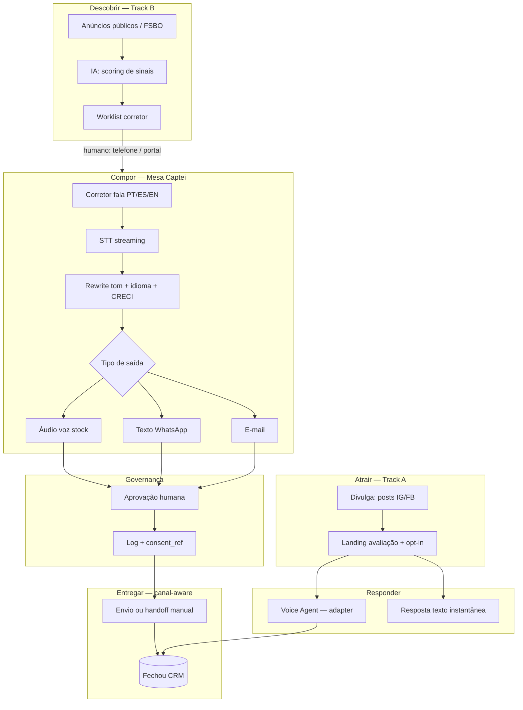

# Diagrama omnichannel — export para o vídeo

Fonte: [`proposta/arquitetura-omnichannel.md`](proposta/arquitetura-omnichannel.md).  
Asset estático: [`/connect-ia-architecture.svg`](/connect-ia-architecture.svg) (também em `public/connect-ia-architecture.svg`).

Usar no bloco IA do vídeo ([`inscricao/video-roteiro.md`](inscricao/video-roteiro.md), **1:25–2:10**).

---

## 1. Mermaid (copiar para slide / mermaid.live)



Export rápido: abrir [mermaid.live](https://mermaid.live), colar o bloco, PNG 1920×1080, fundo claro (`#f4efe6`).

---

## 2. ASCII fallback (screenshot se o Mermaid falhar)

```
  TRACK B                         TRACK A
  anúncio / FSBO                  Divulga → landing opt-in
       │                                │
       ▼                                ▼
  score IA → worklist            Voice Agent + texto
       │                         (qualificação ao vivo)
       │  humano telefona               │
       └────────────┬───────────────────┘
                    ▼
            MESA MULTICANAL
     mic → STT → LLM rewrite
           ├── WhatsApp (texto)
           ├── E-mail
           └── Áudio (voz stock)
                    │
                    ▼
           APROVAÇÃO HUMANA
           log + consent_ref
                    │
                    ▼
        handoff manual → CRM
        (sem disparo frio WA)

  compose/ + consent/  →  providers/*  →  AssemblyAI (demo atual)
```

---

## 3. Beats de vídeo — bloco IA (~45 s, 1:25–2:10)

Alinhado a [`inscricao/video-roteiro.md`](inscricao/video-roteiro.md).

| Relativo | Relógio | Mostrar | Falar |
|----------|---------|---------|--------|
| 0–8 s | 1:25 | Título “IA no centro” + logo Captei | “A Inteligência Artificial é o motor. Stack multi-provedor; AssemblyAI na demo atual.” |
| 8–18 s | 1:33 | Mic → STT | STT multilíngue captura o rough do corretor. |
| 18–28 s | 1:43 | LLM → {WA \| e-mail \| áudio} | LLM reescreve tom, idioma, CRECI. |
| 28–36 s | 1:53 | Track A → Voice Agent | Agente de voz qualifica quem já optou. |
| 36–45 s | 2:01 | Gate “aprovação humana” + X em “cold WA” | Orquestração conforme consentimento; **sem disparo frio**. |

Depois (2:10): voltar para câmera — estágio + mercado.

---

## Screenshot da demo

Além do diagrama: `/compose/demo` com as três abas visíveis (WhatsApp | E-mail | Áudio) para o slide 4 do pitch e o cut 0:55–1:20 do vídeo.
