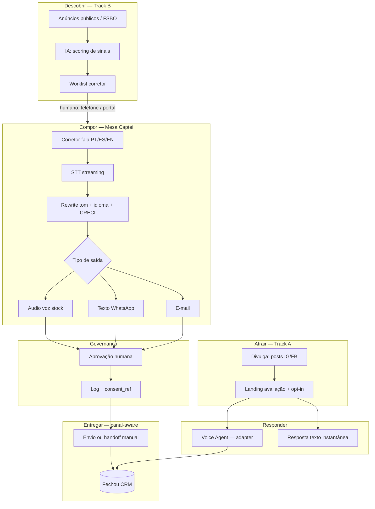

# Captei — Arquitetura omnichannel (Connect IA)

Visão técnica para vídeo, one-pager e formulário (critério IA 40%).

---

## Fluxo de alto nível

---

## Níveis de automação (compliance)

| Nível | Estado do proprietário | Automação | Canais |
|-------|------------------------|-----------|--------|
| 0 | Sinal público, sem PII | Score + fila | Interno |
| 1 | Contato publicado, sem opt-in WA | Rascunhos IA; **humano envia** | E-mail*, portal, telefone |
| 2 | Respondeu / opt-in parcial | Qualify voice + texto | WA manual, e-mail |
| 3 | Consentimento Track A | Cadência + compose aprovado | WA**, e-mail, voz |
| 4 | Cliente / mandato | Reactivação (Prince) | Todos consented |

\* E-mail só se publicado para aquele fim; opt-out disponível.  
\*\* WhatsApp automatizado só com opt-in + janela/template conforme Meta.

---

## Stack atual vs. roadmap

| Componente | Repo | Status |
|------------|------|--------|
| Compose desk (voz) | `captei-voz` | ✅ Demo |
| Qualify live agent | `captei-voz` | ✅ Demo |
| ✅ Mesa multicanal (WA + e-mail + áudio) | `captei-voz` | ✅ Demo (`/compose/demo`) |
| Provider adapters (interfaces) | `captei-voz/lib/providers` | ✅ Scaffold; AssemblyAI = adapter atual |
| Captação strategy + legal | `CRM/docs/captacao/` | ✅ Docs |
| CRM pipeline | `CRM` | Epic 1 (auth) |
| Speed-to-lead | `Prince` | Planejado |
| Social publish | `Divulga` | Em uso |

---

## Mensagem para o comitê (IA)

Captei não é “CRM com ChatGPT”. É **orquestração agentica multicanal** onde:

1. cada canal tem regras de entrega distintas;
2. a IA gera conteúdo adaptado ao canal e ao idioma;
3. um **gate de consentimento** decide o que pode ser automatizado;
4. humanos aprovam antes de qualquer outbound de risco reputacional.

Isso é IA aplicada a problema real com restrições de plataforma — não IA genérica.

**Pitch line:** stack multi-provedor; AssemblyAI na demo atual.
